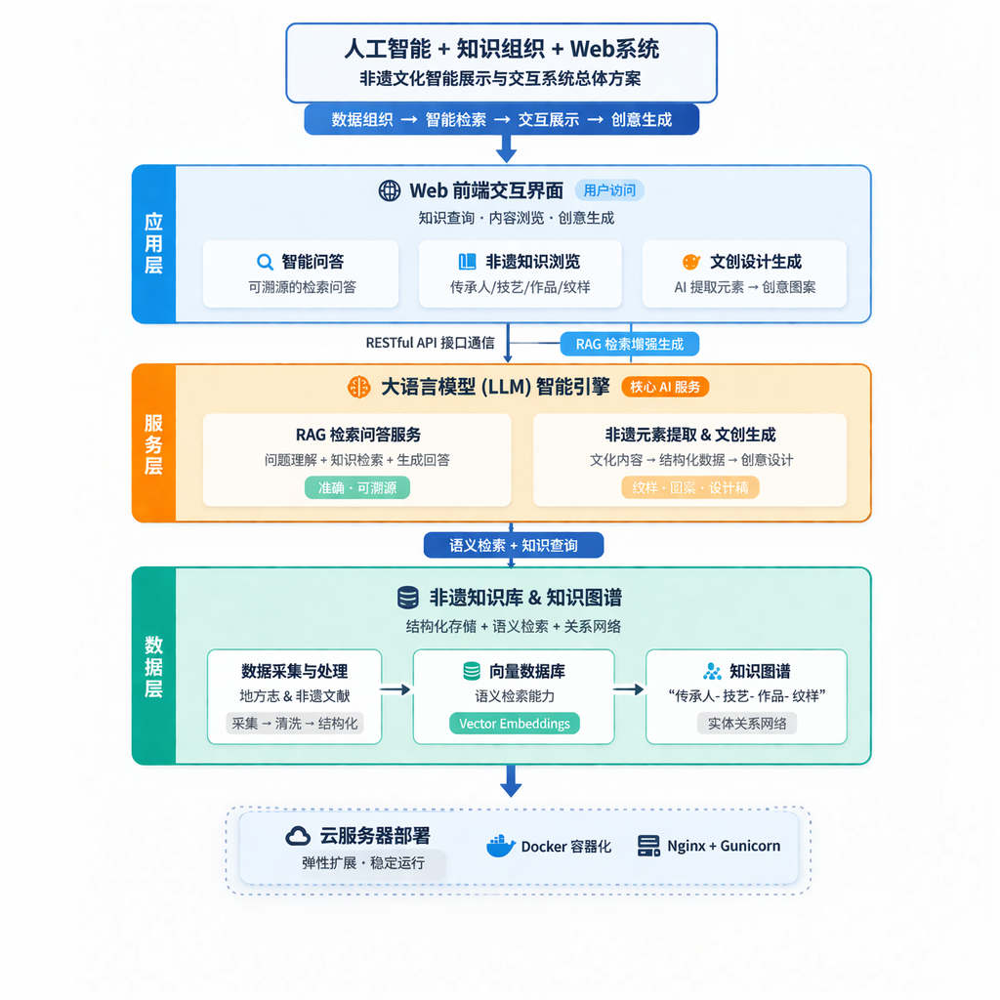

# 地方志&非遗文化“数字生命互动引擎开发任务书
---

## 一、背景介绍

随着数字化技术的发展，传统非物质文化遗产的传播方式仍以静态图文和线下展示为主，存在传播范围有限、互动性不足、年轻群体参与度低等问题。尤其是在地方志与非遗技艺领域，大量文化内容分散在文献与图片中，缺乏统一组织与智能检索手段，用户难以进行深入理解与探索。  

因此，有必要构建一个基于人工智能与知识组织技术的数字化平台，以提升非遗文化的传播效率与交互体验。

---

## 二、欲解决问题

本项目旨在解决以下问题：

- 地方志与非遗知识分散，检索困难  
- 传统展示方式缺乏交互性，难以吸引当下年轻人  
- 用户难以深入理解非遗文化结构与关联  
- 非遗文化与现代创意设计结合不足  

通过本系统用户可以实现：

- 基于自然语言的地方志和非遗知识查询  
- 以知识图谱和AI问答的方式深入了解地方志和非遗知识  
- 基于AI生成文创设计  

通过传统非遗文化从静态展示转变为可交互、可探索、可生成的数字化体验形式，有效提升用户参与度与传播效率。

---

## 三、推荐方案

本系统采用“人工智能 + 知识组织 + Web系统”的综合解决方案，通过多种技术协同实现非遗文化的智能化展示与交互。
在数据层面，系统首先对地方志及非遗相关文献进行采集、清洗与结构化处理，构建统一的非遗知识库，并结合向量数据库实现语义检索能力。同时，利用知识图谱技术建立“传承人-技艺-作品-纹样”等实体之间的关系网络，为复杂查询提供支撑。

- 在服务层面，系统引入大语言模型作为核心智能引擎，通过检索增强生成（RAG）技术，将知识库与用户问题相结合，实现准确、可溯源的问答功能。此外，系统还设计非遗元素提取与文创生成模块，将文化内容转化为结构化数据并进一步生成创意设计结果。
- 在应用层面，系统基于Web前端提供统一交互界面，支持用户进行知识查询、内容浏览与创意生成等操作。各模块通过API接口进行通信，并部署在云服务器环境中，实现系统的稳定运行与扩展能力。
通过上述方案，系统能够形成“数据组织—智能检索—交互展示—创意生成”的完整闭环，有效提升非遗文化的传播与利用效率。 

---

## 四、环境要求

本软件系统从部署与运行角度主要分为客户端、服务器以及外部资源环境三个部分。

- 首先，在客户端方面，系统分为Web客户端和移动应用客户端两种形式，用户可以通过浏览器或手机应用同时登录账户，并根据需求执行不同功能。Web客户端基于WebUI技术，利用HTML、CSS和JavaScript等前端技术实现页面构建与交互展示；移动客户端则基于Android平台进行开发，支持Android 8.0及以上系统版本，满足用户随时随地访问系统的需求。
- 其次，在服务器方面，系统主要包括Web服务器、应用服务器以及数据库服务器等组成。Web客户端通过Web服务器与应用服务器建立连接，移动客户端则可直接通过接口访问应用服务器。应用服务器作为系统核心，负责处理业务逻辑与智能服务，是连接客户端与数据层的关键枢纽。数据库服务器与应用服务器通过数据接口进行通信，实现数据的存储与调用；同时，系统还可接入大语言模型服务模块，通过接口与应用服务器协同工作，为智能问答与内容生成提供支持。
- 最后，在外部资源环境方面，系统主要依赖非遗相关数据资源以及云计算平台。通过对地方志、非遗项目资料等数据进行整合，为系统提供基础知识支撑；同时系统部署在云服务器环境中，以保障运行的稳定性与扩展能力。整体来看，应用服务器在系统中起到核心桥梁作用，实现客户端、数据资源与智能服务之间的高效协同。

---

## 五、功能描述

本系统以AI大模型与多模态技术为底座，致力于打造全方位的数字文化体验闭环，主要功能模块包括：
- 智能非遗知识检索与问答：突破传统的关键词匹配搜索限制，支持用户通过自然语言进行多轮交互式查询。系统底层结合大语言模型与检索增强生成（RAG）技术，能够精准理解用户意图，从海量地方志古籍与非遗文献中深度挖掘信息，提供关于历史渊源、技艺流程、传承人故事等准确、严谨的拟人化解答。
- 可视化知识图谱探索：构建专属的地方文化与非遗知识图谱，将原本孤立的人、事、物、地、时等信息节点进行深度语义关联。系统支持以动态交互的网络图谱形式展示实体间的拓扑关系（如：某位历史名人与特定非遗技艺、地域流派的关联），帮助用户直观、系统地认知复杂的文化脉络。
- 多模态沉浸式数字展馆浏览：建立高清晰度的非遗多媒体资源库，提供超越单一图文的视觉体验。支持高精度的非遗器物影像、古籍文献数字件的在线阅览，以及非遗技艺的动态视频与3D场景展示。结合前端技术，为用户打造全景式、沉浸式的历史场景与非遗工坊虚拟漫游体验。
- 多模态非遗元素智能提取：运用自然语言处理与计算机视觉技术，实现对非结构化文化数据的智能解析。系统能够自动从晦涩的地方志文本中抽取关键史料实体，并能从非遗纹样、手工艺品图片中精准识别并提取色彩搭配、几何特征、核心图腾等视觉美学元素，建立结构化的数字资产标签库。
- AIGC 个性化文创辅助设计：搭载强大的生成式AI模型（文生图/图生图），将结构化提取的传统非遗美学元素与现代设计理念相融合。用户可通过输入提示词或选择特定非遗风格（如剪纸、刺绣、特定窑口陶瓷等），一键生成兼具传统底蕴与现代审美的文创产品设计草图或数字艺术品，赋能文化产业的创新转化。
- 个性化用户中心与安全管理：提供完善的用户注册、多端（Web端与移动端）无缝登录与权限管控机制。系统不仅保障基础数据的加密存储，还能记录用户的浏览足迹、智能对话历史与文创生成作品库，为用户建立个性化的“数字文化探索档案”，同时确保所有交互数据的隐私安全。 

---

## 六、可行性与风险

可行性分析：
- 技术可行性：大模型API与向量数据库技术已较成熟。
- 条件可行性：团队具备Web开发与AI基础。
- 时间可行性：采用分阶段开发策略降低风险。

潜在风险及对策：
- 大模型回答不准确
		通过RAG与知识库约束输出。
- 开发难度较高
		采用模块化开发，优先实现核心功能。
- 地方志和非遗知识资源采集困难
        让每位同学分担一部分资料采集的任务，同时向相关专家请教。
- 系统部署不稳定
 		提前进行服务器测试。

---

## 七、人员分工

- 项目经理谭逸皓：具有统筹领导项目的实际经验，能实时管理各位成员的进度和协调组内的关系，负责进度管理与统筹协调。
- 需求分析负责人刘睿：对传统非遗文化有浓烈的兴趣，对地方志和非遗资料的整理拿手，负责资料收集与需求分析。
- 设计主负责人王宇航：有丰富的美术设计经验，擅长使用PS等软件进行设计，有独特的美术眼光，负责前端页面UI设计。
- 设计副负责人刘逸轩：有丰富的软件工程项目经验，能够胜任工程内数据库方面的设计与框架搭建，负责数据库设计与实现。
- 代码主负责人樊昱天：有丰富的软件工程项目经验，擅长对成员代码进行管理与开发，负责对接大模型API和后端开发。
- 代码副负责人郑世超：有丰富的软件工程项目经验，曾开发过多种多样的前端界面，负责前端界面开发。
- 测试负责人李颜铭：在测试方面有丰富的经验，能对产品的质量进行精确的裁定，负责测试与质量保障。
- 部署和技术负责人张劲：在部署方面有丰富的经验，能对完成的项目在云服务器上进行调试部署，负责部署与系统维护。

---

## 八、参考文献

[1]人民网.徐君康.新媒体时代非遗传承传播问题探析
[2]人民网.黄永林.为非遗传承发展贡献青年力量
[3]中华非物质文化遗产网.薛可 龙靖宜.消弭数字鸿沟：中国非物质文化遗产数字传播新思考